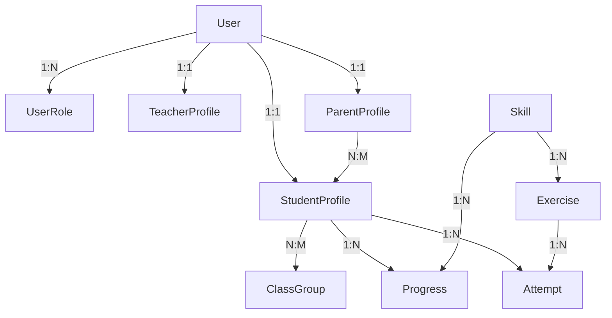

# 📐 ARCHITECTURE TECHNIQUE - ÉCOLE VIRTUELLE CE2

## 🎯 Vue d'Ensemble

Architecture **fullstack monolithique** basée sur Next.js 14 (App Router) avec rendu hybride (SSR + CSR).

```
┌─────────────────────────────────────────────────────────┐
│                    FRONTEND (React)                      │
│  ┌────────────┐  ┌────────────┐  ┌──────────────────┐  │
│  │  Interface  │  │ Interface  │  │    Interface     │  │
│  │   Élève    │  │   Parent   │  │   Professeur     │  │
│  └────────────┘  └────────────┘  └──────────────────┘  │
│                                                          │
│  ┌──────────────────────────────────────────────────┐  │
│  │          Composants UI Réutilisables             │  │
│  │     (Radix UI + Tailwind CSS + shadcn/ui)        │  │
│  └──────────────────────────────────────────────────┘  │
└─────────────────────────────────────────────────────────┘
                            ▼
┌─────────────────────────────────────────────────────────┐
│                 NEXT.JS 14 APP ROUTER                    │
│  ┌────────────┐  ┌────────────┐  ┌──────────────────┐  │
│  │  API Routes│  │Middleware  │  │  Server Actions  │  │
│  │  /api/*    │  │ (Auth)     │  │    (Forms)       │  │
│  └────────────┘  └────────────┘  └──────────────────┘  │
└─────────────────────────────────────────────────────────┘
                            ▼
┌─────────────────────────────────────────────────────────┐
│                  COUCHE MÉTIER (BLL)                     │
│  ┌─────────────────┐  ┌──────────────────────────────┐ │
│  │ Moteur Adaptatif│  │    Services Métier           │ │
│  │  - Difficulté   │  │ - StudentService             │ │
│  │  - Recommand.   │  │ - ExerciseService            │ │
│  │  - Progression  │  │ - EvaluationService          │ │
│  └─────────────────┘  └──────────────────────────────┘ │
└─────────────────────────────────────────────────────────┘
                            ▼
┌─────────────────────────────────────────────────────────┐
│               COUCHE D'ACCÈS DONNÉES (DAL)               │
│  ┌──────────────────────────────────────────────────┐  │
│  │             Prisma ORM Client                     │  │
│  │  - Type-safe queries                              │  │
│  │  - Migrations automatiques                        │  │
│  │  - Relations imbriquées                           │  │
│  └──────────────────────────────────────────────────┘  │
└─────────────────────────────────────────────────────────┘
                            ▼
┌─────────────────────────────────────────────────────────┐
│                    POSTGRESQL                            │
│             Base de données relationnelle                │
└─────────────────────────────────────────────────────────┘
```

## 🏗️ Patterns Architecturaux

### 1. **App Router (Next.js 14)**
- **Server Components** par défaut (performance)
- **Client Components** uniquement si nécessaire (interactivité)
- **Route Groups** pour organiser par rôle `(eleve)`, `(parent)`, etc.
- **Layouts imbriqués** pour éviter la duplication

### 2. **API Routes**
```
/api/
├── auth/                # NextAuth endpoints
├── students/
│   ├── [id]/
│   │   ├── progress/    # GET progression
│   │   ├── attempts/    # POST nouvelle tentative
│   │   └── recommendations/  # GET recommandations
├── exercises/
│   ├── [id]/
│   │   └── submit/      # POST soumettre réponse
├── teachers/
│   └── classes/         # CRUD classes
└── stripe/
    └── webhook/         # Webhooks Stripe
```

### 3. **Services Métier**
```typescript
// src/services/student.service.ts
export class StudentService {
  async getProgress(studentId: string): Promise<Progress[]>
  async updateDifficulty(studentId: string): Promise<void>
  async generateRecommendations(studentId: string): Promise<Recommendation[]>
}

// src/services/exercise.service.ts
export class ExerciseService {
  async submitAttempt(data: AttemptData): Promise<AttemptResult>
  async getAdaptedExercises(studentId: string): Promise<Exercise[]>
  async evaluateAnswer(exerciseId: string, answer: unknown): Promise<boolean>
}
```

## 🔐 Sécurité

### Authentification (NextAuth.js)
```typescript
// Middleware de protection routes
export function middleware(req: NextRequest) {
  const token = await getToken({ req });
  
  // Rediriger si non authentifié
  if (!token) return NextResponse.redirect('/login');
  
  // Vérifier les rôles
  const requiredRole = getRequiredRole(req.nextUrl.pathname);
  if (!hasRole(token, requiredRole)) {
    return NextResponse.json({ error: 'Forbidden' }, { status: 403 });
  }
  
  return NextResponse.next();
}
```

### RBAC (Role-Based Access Control)
```typescript
// Vérification côté serveur
async function requireRole(role: RoleType) {
  const session = await getServerSession();
  if (!session || !hasRole(session.user, role)) {
    throw new Error('Unauthorized');
  }
}

// Exemple utilisation
export async function GET(req: Request) {
  await requireRole(RoleType.PROFESSEUR);
  // ... logique métier
}
```

## 📊 Modèle de Données

### Relations Clés



### Indexes Critiques
```prisma
// Performances optimisées pour requêtes fréquentes
@@index([studentId, skillId])  // Progress lookup
@@index([studentId, createdAt]) // Tentatives récentes
@@index([skillId, isPublished]) // Exercices publiés
@@index([userId, role])         // Vérification rôle
```

## 🧠 Moteur d'Adaptation

### Algorithme Adaptatif
```typescript
// Pseudo-code simplifié
function calculateNewDifficulty(
  currentDifficulty: number,
  recentAttempts: Attempt[]
): number {
  const successRate = calculateSuccessRate(recentAttempts);
  const avgScore = calculateAverageScore(recentAttempts);
  const avgErrors = calculateAverageErrors(recentAttempts);
  
  let adjustment = 0;
  
  // Règles métier
  if (successRate > 0.8 && avgScore > 85) {
    adjustment = +5; // Augmenter difficulté
  } else if (successRate < 0.4 || avgScore < 50) {
    adjustment = -5; // Diminuer difficulté
  }
  
  // Borner entre 0 et 100
  return clamp(currentDifficulty + adjustment, 0, 100);
}
```

### Système de Recommandations
```typescript
// Stratégie de recommandation
enum RecommendationStrategy {
  REMEDIATION,   // Retravailler compétence faible
  REINFORCEMENT, // Renforcer compétence moyenne
  ADVANCEMENT,   // Progresser vers niveau supérieur
  CHALLENGE,     // Défier élève avancé
}

function selectStrategy(progress: Progress): RecommendationStrategy {
  if (progress.level < 40) return RecommendationStrategy.REMEDIATION;
  if (progress.level < 70) return RecommendationStrategy.REINFORCEMENT;
  if (progress.level < 90) return RecommendationStrategy.ADVANCEMENT;
  return RecommendationStrategy.CHALLENGE;
}
```

## 🎨 Architecture Frontend

### Structure Composants
```
components/
├── ui/                    # Composants primitifs (Radix)
│   ├── button.tsx
│   ├── card.tsx
│   ├── progress.tsx
│   └── dialog.tsx
├── student/               # Composants élève
│   ├── ExercisePlayer.tsx     # Moteur exercices
│   ├── ProgressChart.tsx      # Graphique progression
│   ├── RecommendationCard.tsx # Carte recommandation
│   └── SkillTree.tsx          # Arbre compétences
├── teacher/               # Composants professeur
│   ├── ClassDashboard.tsx
│   ├── ExerciseBuilder.tsx
│   └── StudentList.tsx
└── parent/                # Composants parent
    ├── ChildSelector.tsx
    └── ProgressReport.tsx
```

### Design System (Tailwind)
```css
/* Thème enfant-friendly */
.kid-button {
  @apply px-6 py-4 text-xl font-bold rounded-full 
         transition-transform hover:scale-105 active:scale-95
         shadow-lg;
}

.kid-card {
  @apply p-6 bg-white rounded-3xl shadow-xl 
         border-4 border-primary-200;
}

/* Animations encourageantes */
@keyframes celebrate {
  0%, 100% { transform: scale(1); }
  50% { transform: scale(1.2); }
}
```

## 🧪 Types d'Exercices

### Architecture Modulaire
```typescript
// Interface commune
interface ExerciseRenderer {
  type: ExerciseType;
  render(config: Json): JSX.Element;
  evaluate(config: Json, answer: unknown): EvaluationResult;
}

// Implémentation par type
class QCMRenderer implements ExerciseRenderer {
  type = ExerciseType.QCM;
  
  render(config: QCMConfig) {
    // Rendu interface QCM
  }
  
  evaluate(config: QCMConfig, answer: number[]) {
    // Logique validation
  }
}

// Factory pattern
function createExerciseRenderer(type: ExerciseType): ExerciseRenderer {
  switch (type) {
    case ExerciseType.QCM: return new QCMRenderer();
    case ExerciseType.DRAG_DROP: return new DragDropRenderer();
    // ...
  }
}
```

## 📈 Performance

### Optimisations Next.js
- **Static Generation** pour contenu public
- **Incremental Static Regeneration** pour leçons
- **Server Components** pour liste exercices
- **Streaming SSR** pour dashboards complexes

### Optimisations Base de Données
- **Connection pooling** (Prisma)
- **Query batching** (DataLoader pattern)
- **Indexes** sur colonnes filtrées
- **Pagination** curseur-based

### Caching
```typescript
// Cache React (Next.js 14)
import { cache } from 'react';

export const getStudentProgress = cache(async (studentId: string) => {
  return prisma.progress.findMany({ where: { studentId } });
});

// Revalidation
export const revalidate = 60; // 1 minute
```

## 🚀 Déploiement

### Architecture Recommandée (Vercel)
```
┌─────────────────┐
│   Vercel Edge   │ ← CDN global
│   (Next.js)     │
└────────┬────────┘
         │
┌────────▼────────┐
│   PostgreSQL    │ ← Neon / Supabase
│   (Managed)     │
└─────────────────┘

Stripe Webhooks ──┐
                  ▼
         ┌────────────────┐
         │  Vercel Edge   │
         │   Functions    │
         └────────────────┘
```

### Variables d'Environnement
```bash
# Production
DATABASE_URL=
NEXTAUTH_URL=https://ecole.fr
NEXTAUTH_SECRET=

STRIPE_SECRET_KEY=sk_live_...
STRIPE_WEBHOOK_SECRET=whsec_...
```

## 📊 Monitoring

### Métriques Clés
- **Taux de réussite** par compétence
- **Temps moyen** par exercice
- **Progression mensuelle** élèves
- **Engagement** (jours actifs/mois)
- **Performance API** (latence)

### Outils Recommandés
- **Vercel Analytics** (Web Vitals)
- **Prisma Studio** (DB monitoring)
- **Sentry** (Error tracking)
- **PostHog** (Product analytics)

---

**Architecture évolutive et maintenable pour croissance future** 🚀
